# claude-wp-cli



A Claude Code skill that provides complete WordPress content management through the REST API. Manage posts, pages, media, categories, tags, ACF custom fields, and structured data (JSON-LD schema) across multiple WordPress sites -- all from the command line. Content is authored in markdown files and automatically converted to HTML or Gutenberg block markup before publishing.

## Overview

wp-cli turns Claude Code into a WordPress management interface. Every operation -- creating a draft post, uploading an optimized image, scheduling publication, pushing FAQ schema to Rank Math -- is a single CLI command that returns structured JSON. The skill supports managing multiple WordPress sites simultaneously through a per-site configuration system where each site has its own `config.yaml` and `.env.site` credentials file.

The core workflow is: write content in markdown, run a command, and the skill handles conversion (classic HTML or Gutenberg blocks), authentication (HTTP Basic Auth with Application Passwords), and communication with the WordPress REST API. All output is machine-readable JSON with a `status` field ("success" or "error") so Claude Code can chain operations reliably.

**Key design points:**
- Multi-site support with a 4-level site directory resolution chain
- Markdown-to-HTML and markdown-to-Gutenberg conversion with frontmatter stripping
- SEO plugin integration for Rank Math (FAQ block generation), Yoast, and generic schema storage
- Image optimization workflow using Claude Code vision for alt text generation and Pillow for WebP conversion
- All output is structured JSON for programmatic consumption

## Features

- **Post management** -- List, get, create, update, delete, and view revisions for WordPress posts. Supports status filtering, pagination, scheduled publishing, category/tag assignment, and featured images.
- **Page management** -- Full CRUD for pages with support for hierarchical parent pages and page templates.
- **Media library** -- Upload files with automatic MIME type detection, set alt text/caption/title, list and filter media by type, delete media items.
- **Taxonomy management** -- Create, list, and delete categories (with hierarchical parent support) and tags.
- **ACF custom fields** -- Read and update Advanced Custom Fields data on any post using arbitrary JSON payloads.
- **Structured data / schema** -- Push JSON-LD schema to posts through three SEO plugin integrations: Rank Math (auto-generates FAQ Gutenberg blocks), Yoast (stores in post meta), and generic meta storage.
- **Markdown conversion** -- Converts markdown files to classic HTML or Gutenberg block markup. Strips YAML frontmatter and H1 titles. Handles fenced code blocks, tables, attribute lists, headings, lists, blockquotes, images, and separators.
- **Multi-site management** -- Each site is configured independently. The skill resolves site directories through a 4-level fallback chain: `MARVOMATIC_SITES_DIR` env var, `./sites/` in CWD, `CLAUDE_SKILL_CALLER_CWD/sites/`, and `~/.marvomatic/sites/`.
- **Scheduling and publishing** -- Schedule future publication by setting `--status future` with an ISO 8601 `--date`. Default post status is configurable per site.

## Requirements

| Requirement | Version | Notes |
|---|---|---|
| Python | >= 3.10 | Required for type hint syntax used in codebase |
| httpx | >= 0.27 | HTTP client for REST API communication |
| pydantic | >= 2.5 | Configuration model validation |
| pydantic-settings | >= 2.1 | Settings loading from environment variables |
| pyyaml | >= 6.0 | YAML config file parsing |
| python-dotenv | >= 1.0 | `.env.site` credential loading |
| markdown | >= 3.5 | Markdown-to-HTML conversion |
| Pillow | (optional) | Image optimization / WebP conversion workflow |
| WordPress | 5.6+ | REST API with Application Passwords support |

**Dev dependencies (optional):** pytest >= 8.0, respx >= 0.21, pytest-cov >= 4.0

## Installation / Setup

### Step 1: Install Python dependencies

```bash
pip install -r "${CLAUDE_SKILL_DIR}/requirements.txt"
```

### Step 2: Create a site configuration directory

Create a folder under `./sites/<site-id>/` in your working directory (or any location in the resolution chain):

```bash
mkdir -p ./sites/my-blog
```

### Step 3: Write the site config file

Create `./sites/my-blog/config.yaml`:

```yaml
site_id: "my-blog"
site_url: "https://www.example.com"

wordpress:
  site_url: "https://www.example.com"
  default_status: "draft"
  editor_type: "classic"       # classic | gutenberg
  seo_plugin: "none"           # rankmath | yoast | generic | none
  default_category_ids: []
  default_tag_ids: []
  default_author_id: null
  timeout: 30
```

### Step 4: Write the credentials file

Create `./sites/my-blog/.env.site`:

```
WP_USERNAME=your-username
WP_APP_PASSWORD=xxxx xxxx xxxx xxxx xxxx xxxx
```

Generate an Application Password in WordPress Admin at Users > Profile > Application Passwords.

### Step 5: Test the connection

```bash
export CLAUDE_SKILL_CALLER_CWD="$(pwd)" && cd "${CLAUDE_SKILL_DIR}" && python -m cli.main --site my-blog posts list
```

A successful response contains `"status": "success"` in the JSON output.

## Usage

All commands follow this invocation pattern:

```bash
export CLAUDE_SKILL_CALLER_CWD="$(pwd)" && cd "${CLAUDE_SKILL_DIR}" && python -m cli.main --site <site-id> <resource> <action> [options]
```

The `--site` flag is always required and identifies which site configuration to use.

### Posts

| Action | Command | Required Options | Optional Options |
|---|---|---|---|
| List posts | `posts list` | | `--status draft\|publish\|any` (default: any), `--per-page 10`, `--page 1` |
| Get post | `posts get` | `--id <post_id>` | |
| Create post | `posts create` | `--title "Title"` | `--content-file draft.md`, `--status draft\|publish\|future`, `--date 2026-03-20T09:00:00`, `--category-ids 1,2`, `--tag-ids 3,4`, `--featured-media 456` |
| Update post | `posts update` | `--id <post_id>` | `--title "New Title"`, `--content-file updated.md`, `--status publish`, `--date 2026-03-25T09:00:00`, `--featured-media 789` |
| Delete post | `posts delete` | `--id <post_id>` | `--force` (bypass trash) |
| View revisions | `posts revisions` | `--id <post_id>` | |

**Examples:**

```bash
# Create a draft post from a markdown file with categories
python -m cli.main --site my-blog posts create --title "Getting Started with WordPress" --content-file article.md --category-ids 5,12 --tag-ids 3

# Schedule a post for future publication
python -m cli.main --site my-blog posts update --id 123 --status future --date 2026-03-25T09:00:00

# List all published posts, page 2
python -m cli.main --site my-blog posts list --status publish --per-page 20 --page 2
```

### Pages

| Action | Command | Required Options | Optional Options |
|---|---|---|---|
| List pages | `pages list` | | `--status draft\|publish\|any` (default: any), `--per-page 10`, `--page 1` |
| Get page | `pages get` | `--id <page_id>` | |
| Create page | `pages create` | `--title "Title"` | `--content-file page.md`, `--status draft\|publish`, `--parent-id 10`, `--template full-width` |
| Update page | `pages update` | `--id <page_id>` | `--title "..."`, `--content-file page.md`, `--status publish`, `--parent-id 10`, `--template full-width` |
| Delete page | `pages delete` | `--id <page_id>` | `--force` (bypass trash) |

**Examples:**

```bash
# Create a child page with a specific template
python -m cli.main --site my-blog pages create --title "About Us" --content-file about.md --parent-id 2 --template full-width

# Update a page's content and publish it
python -m cli.main --site my-blog pages update --id 45 --content-file updated-about.md --status publish
```

### Media

| Action | Command | Required Options | Optional Options |
|---|---|---|---|
| List media | `media list` | | `--media-type image\|video`, `--per-page 10`, `--page 1` |
| Get media | `media get` | `--id <media_id>` | |
| Upload file | `media upload` | `--file image.png` | `--alt-text "Description"`, `--caption "Photo caption"`, `--title "Image Title"` |
| Delete media | `media delete` | `--id <media_id>` | `--force` |

**Examples:**

```bash
# Upload an image with alt text
python -m cli.main --site my-blog media upload --file hero.webp --alt-text "Hero banner for homepage" --title "Hero Image"

# Set a featured image on a post (two-step workflow)
python -m cli.main --site my-blog media upload --file photo.jpg --alt-text "Product photo"
# Note the media ID from the response, then:
python -m cli.main --site my-blog posts update --id 123 --featured-media 456
```

### Taxonomy

| Action | Command | Required Options | Optional Options |
|---|---|---|---|
| List categories | `taxonomy categories list` | | `--per-page 100` |
| Create category | `taxonomy categories create` | `--name "SEO"` | `--parent-id 5` |
| Delete category | `taxonomy categories delete` | `--id 8` | |
| List tags | `taxonomy tags list` | | `--per-page 100` |
| Create tag | `taxonomy tags create` | `--name "wordpress"` | |
| Delete tag | `taxonomy tags delete` | `--id 12` | |

**Examples:**

```bash
# Create a child category under an existing parent
python -m cli.main --site my-blog taxonomy categories create --name "Technical SEO" --parent-id 5

# List all tags
python -m cli.main --site my-blog taxonomy tags list
```

### Fields (ACF)

| Action | Command | Required Options | Optional Options |
|---|---|---|---|
| Get fields | `fields get` | `--post-id 123` | |
| Update fields | `fields update` | `--post-id 123`, `--data '{"field": "value"}'` | |

**Examples:**

```bash
# Read ACF fields from a post
python -m cli.main --site my-blog fields get --post-id 123

# Update ACF fields with a JSON payload
python -m cli.main --site my-blog fields update --post-id 123 --data '{"hero_title": "Welcome", "show_sidebar": true}'
```

### Schema (Structured Data)

| Action | Command | Required Options | Optional Options |
|---|---|---|---|
| Get schema | `schema get` | `--post-id 123` | |
| Push schema (file) | `schema push` | `--post-id 123`, `--schema-file faq.json` | |
| Push schema (inline) | `schema push` | `--post-id 123`, `--data '{"@type": "FAQPage", ...}'` | |

Schema push behavior depends on the site's `seo_plugin` setting:

| SEO Plugin | Behavior |
|---|---|
| `rankmath` | Converts FAQPage JSON-LD into `wp:rank-math/faq-block` Gutenberg blocks and appends them to the post content. Replaces any existing FAQ blocks. |
| `yoast` | Stores the schema as a JSON string in post meta field `_yoast_wpseo_schema_json`. |
| `generic` | Stores the schema as a JSON string in post meta field `_schema_jsonld`. |
| `none` | Skips schema push; returns `{"skipped": true}`. |

**Examples:**

```bash
# Push FAQ schema from a JSON file (Rank Math site)
python -m cli.main --site my-blog schema push --post-id 123 --schema-file faq.json

# Push inline FAQ schema
python -m cli.main --site my-blog schema push --post-id 123 --data '{"@type": "FAQPage", "mainEntity": [{"@type": "Question", "name": "What is WP-CLI?", "acceptedAnswer": {"@type": "Answer", "text": "A command-line tool for WordPress."}}]}'
```

### Image Optimization Workflow

This is a multi-step workflow that combines several commands with Claude Code's capabilities:

1. Download the image from WordPress using the media get command
2. Read the image with Claude Code's multimodal vision to auto-generate descriptive alt text
3. Convert to WebP with Pillow: `img.save('out.webp', 'WEBP', quality=80)`
4. Upload the optimized WebP with the generated alt text via `media upload`
5. Update the post's featured image to the new media ID via `posts update --featured-media`

### Output Format

All commands return JSON. Success responses:

```json
{
  "status": "success",
  "data": { ... },
  "total": 42,
  "total_pages": 5,
  "page": 1
}
```

Error responses:

```json
{
  "status": "error",
  "code": "rest_post_invalid_id",
  "message": "Invalid post ID.",
  "http_status": 404
}
```

**Exit codes:** 0 = success, 1 = API error, 2 = configuration error.

## Configuration

### Per-Site Config (`config.yaml`)

| Field | Type | Default | Description |
|---|---|---|---|
| `site_id` | string | required | Unique site identifier (used as folder name and `--site` flag value) |
| `site_url` | string | required | WordPress site URL |
| `wordpress.site_url` | string | inherits from `site_url` | WordPress URL (can differ from site_url if WP is in a subdirectory) |
| `wordpress.rest_url` | string | auto-derived | REST API base URL (auto: `{site_url}/wp-json/wp/v2`) |
| `wordpress.default_status` | string | `"draft"` | Default post status when creating posts |
| `wordpress.editor_type` | `"classic"` or `"gutenberg"` | `"classic"` | Controls markdown conversion output format |
| `wordpress.seo_plugin` | `"rankmath"`, `"yoast"`, `"generic"`, or `"none"` | `"none"` | SEO plugin integration for schema push |
| `wordpress.default_category_ids` | list[int] | `[]` | Category IDs auto-assigned to new posts |
| `wordpress.default_tag_ids` | list[int] | `[]` | Tag IDs auto-assigned to new posts |
| `wordpress.default_author_id` | int or null | `null` | Default author ID |
| `wordpress.timeout` | int | `30` | HTTP request timeout in seconds |

### Per-Site Credentials (`.env.site`)

| Variable | Description |
|---|---|
| `WP_USERNAME` | WordPress username for authentication |
| `WP_APP_PASSWORD` | WordPress Application Password (generate at WP Admin > Users > Profile > Application Passwords) |

### Environment Variables

| Variable | Description |
|---|---|
| `MARVOMATIC_SITES_DIR` | Override sites directory location (highest priority in resolution chain) |
| `CLAUDE_SKILL_CALLER_CWD` | Original caller working directory; set automatically by bridge scripts to preserve site resolution when CWD changes |
| `CLAUDE_SKILL_DIR` | Skill installation directory; set automatically by Claude Code |

### Site Directory Resolution Chain

The skill searches for the `sites/` directory in this order:

1. `MARVOMATIC_SITES_DIR` environment variable (if set and directory exists)
2. `./sites/` in the current working directory
3. `CLAUDE_SKILL_CALLER_CWD/sites/` (original caller CWD, used by bridge scripts)
4. `~/.marvomatic/sites/` (global fallback)

## Architecture

```
CLI Layer (cli/)          -- argparse command definitions, input parsing
    |
Client Layer (client/)    -- WordPress REST API domain clients
    |
HTTP Layer (client/http)  -- httpx-based HTTP client with Basic Auth
    |
WordPress REST API        -- remote WordPress site

Models Layer (models/)    -- Pydantic config/secrets + YAML/dotenv loader
Converter (converter/)    -- Markdown-to-HTML/Gutenberg transformation
Scripts (scripts/)        -- Bridge scripts for direct invocation
```

### CLI Layer (`cli/`)

- **`cli/main.py`** -- Entry point. Builds the argparse parser with `--site` as a required global argument. Resolves site config via `SiteRegistry`, creates a `WPClient`, and dispatches to the appropriate subcommand handler. Defines exit codes: 0 success, 1 API error, 2 config error.
- **`cli/posts.py`** -- Posts subcommand handler. Registers list/get/create/update/delete/revisions actions. Loads markdown content files via `convert_markdown()` and parses comma-separated category/tag IDs.
- **`cli/pages.py`** -- Pages subcommand handler. Registers list/get/create/update/delete actions. Supports `--parent-id` and `--template` options.
- **`cli/media.py`** -- Media subcommand handler. Registers list/get/upload/delete actions. Upload accepts `--file`, `--alt-text`, `--caption`, `--title`.
- **`cli/taxonomy.py`** -- Taxonomy subcommand handler with nested `categories` and `tags` subcommands, each with list/create/delete actions.
- **`cli/fields.py`** -- ACF fields subcommand handler. Registers get/update actions. Accepts `--data` as a JSON string for field updates.
- **`cli/schema.py`** -- Schema subcommand handler. Registers get/push actions. Push accepts `--schema-file` or `--data` (inline JSON). Routes to SEO-plugin-specific push logic based on site config.

### Client Layer (`client/`)

- **`client/http.py`** -- Core `WPClient` class. Uses httpx with HTTP Basic Auth (base64-encoded Application Password). Provides `get()`, `get_list()` (with `X-WP-Total`/`X-WP-TotalPages` header parsing), `post()`, `post_file()` (binary upload with `Content-Disposition`), and `delete()` methods. Defines `WPAPIError` exception and `json_output()`/`error_output()` formatting helpers.
- **`client/posts.py`** -- `PostsClient`: CRUD + revisions for the `/posts` endpoint. Applies default status, categories, and tags from site config on create.
- **`client/pages.py`** -- `PagesClient`: CRUD for the `/pages` endpoint. Supports parent and template fields.
- **`client/media.py`** -- `MediaClient`: list/get/upload/delete for the `/media` endpoint. Upload reads file bytes, detects MIME type via the `mimetypes` module, uploads via `post_file()`, then optionally updates alt_text/caption/title in a second request.
- **`client/taxonomy.py`** -- `TaxonomyClient`: CRUD for `/categories` and `/tags` endpoints. Categories support hierarchical parent.
- **`client/fields.py`** -- `FieldsClient`: get/update ACF data via the posts endpoint with an `acf` payload. Supports a `post_type` parameter for custom post types.
- **`client/schema.py`** -- `SchemaClient`: get schema meta and push schema data. Three code paths by `seo_plugin`: Yoast (meta `_yoast_wpseo_schema_json`), generic (meta `_schema_jsonld`), and Rank Math (generates Gutenberg FAQ blocks from FAQPage schema, replaces existing FAQ blocks in post content via regex).

### Converter (`converter/`)

- **`converter/markdown.py`** -- Three-stage conversion pipeline: `strip_frontmatter()` removes YAML front matter and H1 titles, `markdown_to_html()` converts via python-markdown with fenced_code/tables/attr_list extensions, `markdown_to_gutenberg()` splits HTML into top-level block elements and wraps each in Gutenberg comment markers. Handles 12 HTML element types for Gutenberg wrapping: paragraph, heading (h1-h6), list (ordered/unordered), blockquote, code, table, image, separator, and HTML fallback.

### Models (`models/`)

- **`models/config.py`** -- Pydantic models: `WordPressConfig` (site_url, rest_url auto-derived, default_status, editor_type, seo_plugin, defaults for categories/tags/author, timeout), `WordPressSecrets` (wp_username, wp_app_password as `SecretStr`), and `SiteConfig` (combines site_id, site_url, WordPressConfig, and optional secrets).
- **`models/loader.py`** -- `SiteRegistry` class with the 4-level site resolution chain, YAML config loading, `.env.site` dotenv credential loading, and per-site config caching. Exposes `list_sites()` for discovery.

### Bridge Scripts (`scripts/`)

- **`scripts/manage_posts.py`** -- Posts bridge script for direct invocation.
- **`scripts/manage_pages.py`** -- Pages bridge script.
- **`scripts/manage_taxonomy.py`** -- Taxonomy bridge script.
- **`scripts/upload_media.py`** -- Media upload bridge script.
- **`scripts/update_fields.py`** -- ACF fields bridge script.
- **`scripts/push_schema.py`** -- Schema push bridge script.

All bridge scripts wrap `cli.main` via subprocess, preserving `CLAUDE_SKILL_CALLER_CWD` for correct site directory resolution when the working directory changes.

### Configuration Templates (`sites_template/`)

- **`sites_template/config.yaml`** -- Example site configuration with all fields documented.
- **`sites_template/.env.site`** -- Example credentials file with placeholder values.

### Other Files

- **`SKILL.md`** -- Main skill definition file with triggers, usage reference, and all available commands.
- **`pyproject.toml`** -- Python package configuration, dependency declarations, and `wp-cli` entry point.
- **`requirements.txt`** -- Pinned runtime dependency versions.

## Troubleshooting

### "Site config not found" error (exit code 2)

The skill cannot locate the `config.yaml` for the specified `--site` value. Verify that:
- A directory named `sites/<site-id>/` exists in one of the resolution chain locations
- The directory contains a valid `config.yaml` file
- If using bridge scripts, `CLAUDE_SKILL_CALLER_CWD` is set to the directory containing `sites/`

### "No .env.site found" error (exit code 2)

The site directory exists but has no `.env.site` credentials file. Create one with `WP_USERNAME` and `WP_APP_PASSWORD` entries.

### HTTP 401 Unauthorized

The Application Password is incorrect or has been revoked. Generate a new one at WP Admin > Users > Profile > Application Passwords. Ensure the password in `.env.site` includes the spaces between groups (e.g., `xxxx xxxx xxxx xxxx xxxx xxxx`).

### HTTP 403 Forbidden

The authenticated WordPress user does not have sufficient permissions for the requested operation. Ensure the user has the appropriate WordPress role (Editor or Administrator).

### Schema push returns `{"skipped": true}`

The site's `seo_plugin` setting in `config.yaml` is set to `"none"`. Change it to `"rankmath"`, `"yoast"`, or `"generic"` to enable schema push.

### Rank Math FAQ push returns null

The Rank Math integration only processes `FAQPage` schema type. Ensure the schema JSON has `"@type": "FAQPage"` and a non-empty `mainEntity` array with valid Question objects.

### Markdown content not converting to Gutenberg blocks

Check that `editor_type` in `config.yaml` is set to `"gutenberg"`. When set to `"classic"` (the default), content is converted to plain HTML without Gutenberg block wrappers.

### File upload fails with incorrect MIME type

The skill uses Python's `mimetypes` module for automatic detection based on file extension. If the extension is unusual or missing, the MIME type may not be detected correctly. Use standard file extensions (`.jpg`, `.png`, `.webp`, `.mp4`, etc.).
